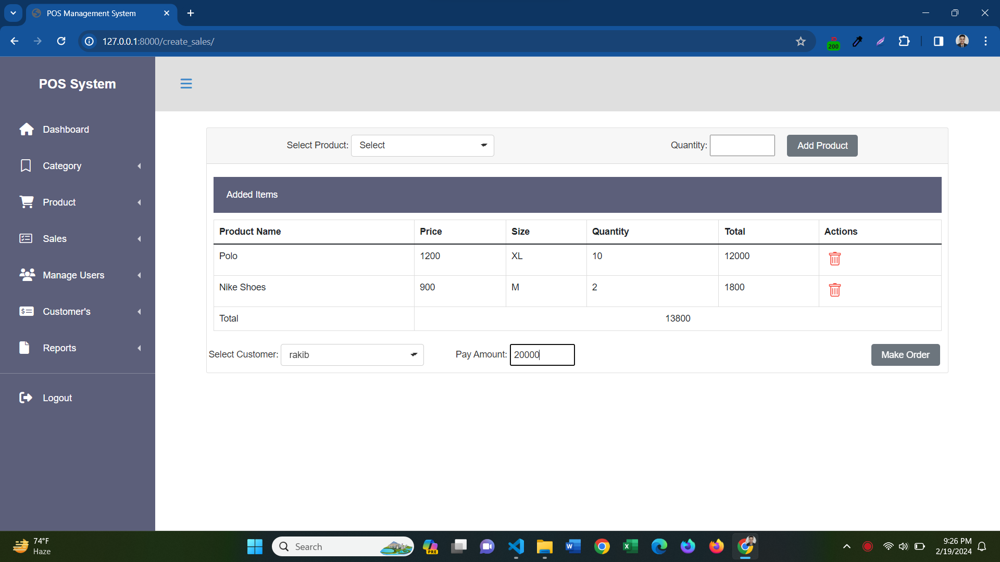

This system is a comprehensive Point of Sale (POS) platform designed for efficient business management. It encompasses key features such as role-based user authentication, an informative dashboard for statistics, and robust management capabilities for categories, products, sellers, customers, orders, payments, and report generation. The system aims to provide a user-friendly experience with specific functionalities tailored for administrators, sellers, and customers. With a focus on accessibility and data-driven decision-making, the POS system offers a seamless and organized approach to handle various aspects of retail operations.

**Technology: Python, Django, Django-rest-framework, jQuery, Bootstrap, Css, HTML**

**User Requirements**
1.	Role Based User:
2.	Dashboard Statistic Management:
3.	Category Management:
4.	Product Management:
5.	Seller Management:
6.	Customer Management:
7.	Order Management:
8.	Payment Management:
9.	Report Generate:

